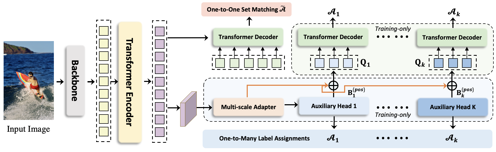
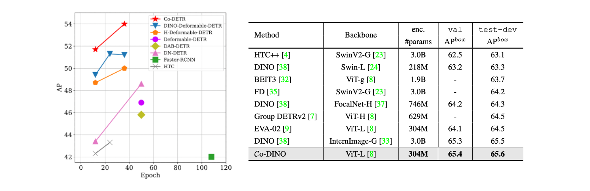

# DETRs with Collaborative Hybrid Assignments Training

[](https://paperswithcode.com/sota/object-detection-on-coco-minival?p=detrs-with-collaborative-hybrid-assignments)
[](https://paperswithcode.com/sota/object-detection-on-coco?p=detrs-with-collaborative-hybrid-assignments)	
[](https://paperswithcode.com/sota/object-detection-on-lvis-v1-0-minival?p=detrs-with-collaborative-hybrid-assignments)
[](https://paperswithcode.com/sota/object-detection-on-lvis-v1-0-val?p=detrs-with-collaborative-hybrid-assignments)
[](https://paperswithcode.com/sota/instance-segmentation-on-lvis-v1-0-val?p=detrs-with-collaborative-hybrid-assignments)

This repo is the official implementation of ["DETRs with Collaborative Hybrid Assignments Training"](https://arxiv.org/pdf/2211.12860.pdf) by Zhuofan Zong, Guanglu Song, and Yu Liu.


## News

* ***[04/22/2024]*** We release a new MLLM framework [MoVA](https://github.com/TempleX98/MoVA), which adopts Co-DETR as the vision expert and achieves state-of-the-art performance on multimodal benchmarks.
* ***[10/19/2023]*** Our SOTA model Co-DETR w/ ViT-L is released now. Please refer to [this page](https://github.com/Sense-X/Co-DETR/blob/main/docs/en/sota_release.md) for more details.
* ***[09/10/2023]*** We release LVIS inference configs and a stronger LVIS detector that achieves **64.5 box AP**.
* ***[08/21/2023]*** Our O365 pre-trained Co-DETR with Swin-L achieves **64.8 AP** on COCO test-dev. The config and weights are released.
* ***[07/20/2023]*** Code for Co-DINO is released: **55.4 AP** with ResNet-50 and **60.7 AP** with Swin-L.
* ***[07/14/2023]*** Co-DETR is accepted to ICCV 2023!
* ***[07/12/2023]*** We finetune Co-DETR on LVIS and achieve the best results **without TTA**: **72.0 box AP** and **59.7 mask AP** on LVIS minival, **68.0 box AP** and **56.0 mask AP** on LVIS val. For instance segmentation, we report the performance of the auxiliary mask branch.
* ***[07/03/2023]*** Co-DETR with [ViT-L](https://github.com/baaivision/EVA/tree/master/EVA-02) **(304M parameters)** sets a new record of <strike>65.6</strike> **66.0 AP** on COCO test-dev, surpassing the previous best model [InternImage-G](https://github.com/OpenGVLab/InternImage) **(~3000M parameters)**. It is the **first model to exceed 66.0 AP on COCO test-dev**.
* ***[07/03/2023]*** Code for Co-Deformable-DETR is released.
* ***[04/05/2023]*** [HoP](https://github.com/Sense-X/HoP) leverages Co-DETR as the backbone and achieves new SOTA performance on [nuScenes 3D detection leaderboard](https://www.nuscenes.org/object-detection?externalData=all&mapData=all&modalities=Camera).
* ***[11/19/2022]*** We achieved 64.4 AP on COCO minival and 64.5 AP on COCO test-dev with only ImageNet-1K as pre-training data. Codes will be available soon.
   

## Introduction



In this paper, we present a novel collaborative hybrid assignments training scheme, namely Co-DETR, to learn more efficient and effective DETR-based detectors from versatile label assignment manners. 
1. **Encoder optimization**: The proposed training scheme can easily enhance the encoder's learning ability in end-to-end detectors by training multiple parallel auxiliary heads supervised by one-to-many label assignments. 
2. **Decoder optimization**: We conduct extra customized positive queries by extracting the positive coordinates from these auxiliary heads to improve attention learning of the decoder. 
3. **State-of-the-art performance**: Co-DETR with [ViT-L](https://github.com/baaivision/EVA/tree/master/EVA-02) (304M parameters) is **the first model to achieve 66.0 AP on COCO test-dev.**



## Model Zoo

### Objects365 pre-trained Co-DETR

Note: the inconsistent pre-training and fine-tuning augmentation settings (DETR and LSJ aug) for the Swin-L model degenerate the performance on LVIS.
| Model  | Backbone | Epochs | Aug | Dataset | box AP (val) | Config | Download |
| ------ | -------- | ------ | --- | ------- | ------------ | ------ | ----- |
| Co-DINO | Swin-L | 16 | DETR | COCO | 64.1 | [config](https://github.com/Sense-X/Co-DETR/blob/main/projects/configs/co_dino/co_dino_5scale_swin_large_16e_o365tococo.py) | [model](https://drive.google.com/drive/folders/1nAXOkzqrEgz-YnXxIEs4d5j9li_kmrnv?usp=sharing) |
| Co-DINO | Swin-L | 16 | LSJ | LVIS | 64.5 | [config (test)](https://github.com/Sense-X/Co-DETR/blob/main/projects/configs/co_dino/co_dino_5scale_lsj_swin_large_16e_o365tolvis.py) | [model](https://drive.google.com/drive/folders/1nAXOkzqrEgz-YnXxIEs4d5j9li_kmrnv?usp=sharing) |
| Co-DINO | ViT-L | 16 | LSJ | LVIS | 68.0 | [config (test)](https://github.com/Sense-X/Co-DETR/blob/main/docs/en/sota_release.md) | [model](https://github.com/Sense-X/Co-DETR/blob/main/docs/en/sota_release.md) |

### Co-DETR with ResNet-50

| Model  | Backbone | Epochs | Aug | Dataset | box AP | Config | Download |
| ------ | -------- | ------ | --- | ------- | ------ | ------ | ----- |
| Co-DINO | R50 | 12 | DETR | COCO | 52.1 | [config](https://github.com/Sense-X/Co-DETR/blob/main/projects/configs/co_dino/co_dino_5scale_r50_1x_coco.py) | [model](https://drive.google.com/drive/folders/1nAXOkzqrEgz-YnXxIEs4d5j9li_kmrnv?usp=sharing) |
| Co-DINO | R50 | 12 | LSJ | COCO | 52.1 | [config](https://github.com/Sense-X/Co-DETR/blob/main/projects/configs/co_dino/co_dino_5scale_lsj_r50_1x_coco.py) | [model](https://drive.google.com/drive/folders/1nAXOkzqrEgz-YnXxIEs4d5j9li_kmrnv?usp=sharing) |
| Co-DINO-9enc | R50 | 12 | LSJ | COCO | 52.6 | [config](https://github.com/Sense-X/Co-DETR/blob/main/projects/configs/co_dino/co_dino_5scale_9encoder_lsj_r50_1x_coco.py) | [model](https://drive.google.com/drive/folders/1nAXOkzqrEgz-YnXxIEs4d5j9li_kmrnv?usp=sharing) |
| Co-DINO | R50 | 36 | LSJ | COCO | 54.8 | [config](https://github.com/Sense-X/Co-DETR/blob/main/projects/configs/co_dino/co_dino_5scale_lsj_r50_3x_coco.py) | [model](https://drive.google.com/drive/folders/1nAXOkzqrEgz-YnXxIEs4d5j9li_kmrnv?usp=sharing) |
| Co-DINO-9enc | R50 | 36 | LSJ | COCO | 55.4 | [config](https://github.com/Sense-X/Co-DETR/blob/main/projects/configs/co_dino/co_dino_5scale_9encoder_lsj_r50_3x_coco.py) | [model](https://drive.google.com/drive/folders/1nAXOkzqrEgz-YnXxIEs4d5j9li_kmrnv?usp=sharing) |


### Co-DETR with Swin-L

| Model  | Backbone | Epochs | Aug | Dataset | box AP | Config | Download |
| ------ | -------- | ------ | --- | ------- | ------ | ------ | ----- |
| Co-DINO | Swin-L | 12 | DETR | COCO | 58.9 | [config](https://github.com/Sense-X/Co-DETR/blob/main/projects/configs/co_dino/co_dino_5scale_swin_large_1x_coco.py) | [model](https://drive.google.com/drive/folders/1nAXOkzqrEgz-YnXxIEs4d5j9li_kmrnv?usp=sharing) |
| Co-DINO | Swin-L | 24 | DETR | COCO | 59.8 | [config](https://github.com/Sense-X/Co-DETR/blob/main/projects/configs/co_dino/co_dino_5scale_swin_large_2x_coco.py) | [model](https://drive.google.com/drive/folders/1nAXOkzqrEgz-YnXxIEs4d5j9li_kmrnv?usp=sharing) |
| Co-DINO | Swin-L | 36 | DETR | COCO | 60.0 | [config](https://github.com/Sense-X/Co-DETR/blob/main/projects/configs/co_dino/co_dino_5scale_swin_large_3x_coco.py) | [model](https://drive.google.com/drive/folders/1nAXOkzqrEgz-YnXxIEs4d5j9li_kmrnv?usp=sharing) |
| Co-DINO | Swin-L | 12 | LSJ | COCO | 59.3 | [config](https://github.com/Sense-X/Co-DETR/blob/main/projects/configs/co_dino/co_dino_5scale_lsj_swin_large_1x_coco.py) | [model](https://drive.google.com/drive/folders/1nAXOkzqrEgz-YnXxIEs4d5j9li_kmrnv?usp=sharing) |
| Co-DINO | Swin-L | 24 | LSJ | COCO | 60.4 | [config](https://github.com/Sense-X/Co-DETR/blob/main/projects/configs/co_dino/co_dino_5scale_lsj_swin_large_2x_coco.py) | [model](https://drive.google.com/drive/folders/1nAXOkzqrEgz-YnXxIEs4d5j9li_kmrnv?usp=sharing) |
| Co-DINO | Swin-L | 36 | LSJ | COCO | 60.7 | [config](https://github.com/Sense-X/Co-DETR/blob/main/projects/configs/co_dino/co_dino_5scale_lsj_swin_large_3x_coco.py) | [model](https://drive.google.com/drive/folders/1nAXOkzqrEgz-YnXxIEs4d5j9li_kmrnv?usp=sharing) |
| Co-DINO | Swin-L | 36 | LSJ | LVIS | 56.9 | [config (test)](https://github.com/Sense-X/Co-DETR/blob/main/projects/configs/co_dino/co_dino_5scale_lsj_swin_large_3x_lvis.py) | [model](https://drive.google.com/drive/folders/1nAXOkzqrEgz-YnXxIEs4d5j9li_kmrnv?usp=sharing) |

### Co-Deformable-DETR

| Model  | Backbone | Epochs | Queries | box AP | Config | Download |
| ------ | -------- | ------ | ------- | ------ | ---- | --- |
| Co-Deformable-DETR | R50 | 12 | 300 | 49.5 | [config](https://github.com/Sense-X/Co-DETR/blob/main/projects/configs/co_deformable_detr/co_deformable_detr_r50_1x_coco.py) | [model](https://drive.google.com/drive/folders/1asWoZ3SuM6APTL9D-QUF_YW9mjULNdh9?usp=sharing) \| [log](https://drive.google.com/drive/folders/1GktHRm2oAxmOzdK3jPaRqNu4uOQhecgZ?usp=sharing) |
| Co-Deformable-DETR | Swin-T | 12 | 300 | 51.7 | [config](https://github.com/Sense-X/Co-DETR/blob/main/projects/configs/co_deformable_detr/co_deformable_detr_swin_tiny_1x_coco.py) | [model](https://drive.google.com/drive/folders/1asWoZ3SuM6APTL9D-QUF_YW9mjULNdh9?usp=sharing) \| [log](https://drive.google.com/drive/folders/1GktHRm2oAxmOzdK3jPaRqNu4uOQhecgZ?usp=sharing) |
| Co-Deformable-DETR | Swin-T | 36 | 300 | 54.1 | [config](https://github.com/Sense-X/Co-DETR/blob/main/projects/configs/co_deformable_detr/co_deformable_detr_swin_tiny_3x_coco.py) | [model](https://drive.google.com/drive/folders/1asWoZ3SuM6APTL9D-QUF_YW9mjULNdh9?usp=sharing) \| [log](https://drive.google.com/drive/folders/1GktHRm2oAxmOzdK3jPaRqNu4uOQhecgZ?usp=sharing) |
| Co-Deformable-DETR | Swin-S | 12 | 300 | 53.4 | [config](https://github.com/Sense-X/Co-DETR/blob/main/projects/configs/co_deformable_detr/co_deformable_detr_swin_small_1x_coco.py) | [model](https://drive.google.com/drive/folders/1asWoZ3SuM6APTL9D-QUF_YW9mjULNdh9?usp=sharing) \| [log](https://drive.google.com/drive/folders/1GktHRm2oAxmOzdK3jPaRqNu4uOQhecgZ?usp=sharing) |
| Co-Deformable-DETR | Swin-S | 36 | 300 | 55.3 | [config](https://github.com/Sense-X/Co-DETR/blob/main/projects/configs/co_deformable_detr/co_deformable_detr_swin_small_3x_coco.py) | [model](https://drive.google.com/drive/folders/1asWoZ3SuM6APTL9D-QUF_YW9mjULNdh9?usp=sharing) \| [log](https://drive.google.com/drive/folders/1GktHRm2oAxmOzdK3jPaRqNu4uOQhecgZ?usp=sharing) |
| Co-Deformable-DETR | Swin-B | 12 | 300 | 55.5 | [config](https://github.com/Sense-X/Co-DETR/blob/main/projects/configs/co_deformable_detr/co_deformable_detr_swin_base_1x_coco.py) | [model](https://drive.google.com/drive/folders/1asWoZ3SuM6APTL9D-QUF_YW9mjULNdh9?usp=sharing) \| [log](https://drive.google.com/drive/folders/1GktHRm2oAxmOzdK3jPaRqNu4uOQhecgZ?usp=sharing) |
| Co-Deformable-DETR | Swin-B | 36 | 300 | 57.5 | [config](https://github.com/Sense-X/Co-DETR/blob/main/projects/configs/co_deformable_detr/co_deformable_detr_swin_base_3x_coco.py) | [model](https://drive.google.com/drive/folders/1asWoZ3SuM6APTL9D-QUF_YW9mjULNdh9?usp=sharing) \| [log](https://drive.google.com/drive/folders/1GktHRm2oAxmOzdK3jPaRqNu4uOQhecgZ?usp=sharing) |
| Co-Deformable-DETR | Swin-L | 12 | 300 | 56.9 | [config](https://github.com/Sense-X/Co-DETR/blob/main/projects/configs/co_deformable_detr/co_deformable_detr_swin_large_1x_coco.py) | [model](https://drive.google.com/drive/folders/1asWoZ3SuM6APTL9D-QUF_YW9mjULNdh9?usp=sharing) \| [log](https://drive.google.com/drive/folders/1GktHRm2oAxmOzdK3jPaRqNu4uOQhecgZ?usp=sharing) |
| Co-Deformable-DETR | Swin-L | 36 | 900 | 58.5 | [config](https://github.com/Sense-X/Co-DETR/blob/main/projects/configs/co_deformable_detr/co_deformable_detr_swin_large_900q_3x_coco.py) | [model](https://drive.google.com/drive/folders/1asWoZ3SuM6APTL9D-QUF_YW9mjULNdh9?usp=sharing) \| [log](https://drive.google.com/drive/folders/1GktHRm2oAxmOzdK3jPaRqNu4uOQhecgZ?usp=sharing) |

## Running

### Install
We implement Co-DETR using [MMDetection V2.25.3](https://github.com/open-mmlab/mmdetection/releases/tag/v2.25.3) and [MMCV V1.5.0](https://github.com/open-mmlab/mmcv/releases/tag/v1.5.0).
The source code of MMdetection has been included in this repo and you only need to build MMCV following [official instructions](https://github.com/open-mmlab/mmcv/tree/v1.5.0#installation).
We test our models under ```python=3.7.11,pytorch=1.11.0,cuda=11.3```. Other versions may not be compatible. 

### Data
The COCO dataset and LVIS dataset should be organized as:
```
Co-DETR
└── data
    ├── coco
    │   ├── annotations
    │   │      ├── instances_train2017.json
    │   │      └── instances_val2017.json
    │   ├── train2017
    │   └── val2017
    │
    └── lvis_v1
        ├── annotations
        │      ├── lvis_v1_train.json
        │      └── lvis_v1_val.json
        ├── train2017
        └── val2017        
```

### Training
Train Co-Deformable-DETR + ResNet-50 with 8 GPUs:
```shell
sh tools/dist_train.sh projects/configs/co_deformable_detr/co_deformable_detr_r50_1x_coco.py 8 path_to_exp
```
Train using slurm:
```shell
sh tools/slurm_train.sh partition job_name projects/configs/co_deformable_detr/co_deformable_detr_r50_1x_coco.py path_to_exp
```

### Testing
Test Co-Deformable-DETR + ResNet-50 with 8 GPUs, and evaluate:
```shell
sh tools/dist_test.sh  projects/configs/co_deformable_detr/co_deformable_detr_r50_1x_coco.py path_to_checkpoint 8 --eval bbox
```
Test using slurm:
```shell
sh tools/slurm_test.sh partition job_name projects/configs/co_deformable_detr/co_deformable_detr_r50_1x_coco.py path_to_checkpoint --eval bbox
```

## Cite Co-DETR

If you find this repository useful, please use the following BibTeX entry for citation.

```latex
@misc{codetr2022,
      title={DETRs with Collaborative Hybrid Assignments Training},
      author={Zhuofan Zong and Guanglu Song and Yu Liu},
      year={2022},
      eprint={2211.12860},
      archivePrefix={arXiv},
      primaryClass={cs.CV}
}
```

## License

This project is released under the MIT license. Please see the [LICENSE](LICENSE) file for more information.
